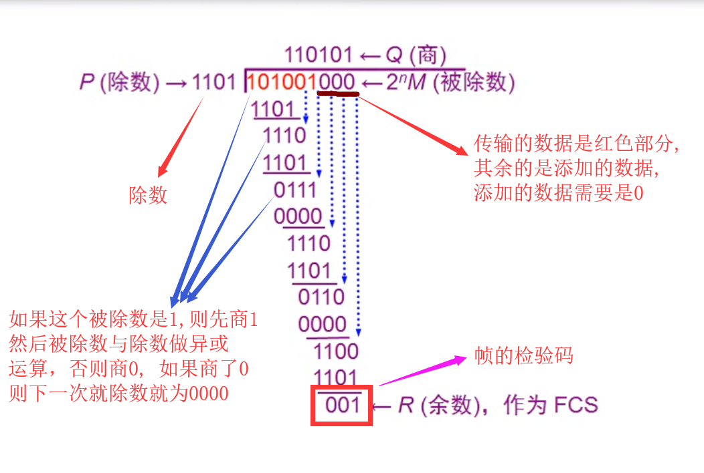

#### 封装成帧
```
由于在网络中传输的数据很多, 那么就需要界定多个不同的数据, 所以需要将它们封装成帧, 
将网络层传下来的数据包作为数据链路层的数据部分, 然后在该数据的前后添加一个帧的开始
和结束标记, 一般是一个字符, 例如开始帧0000 0001, 结束帧0000 0100
```
#### 透明传输
```
由封装成帧引起的问题, 在数据部分出现了帧的开始或者结束的字符, 需要通过转义字符ESC来
进行标记, 对数据部分本身出现的帧的开始字符, 结束以及转义字符进行转义, 网卡在接收数据
时就会对转义字符进行视而不见, 所以叫透明传输
```
##### 实现透明传输的方法
```
字符填充法: 利用转义字符如ESC来进行对非标记字符进行转义, 接收端则将这个转义字符去掉
零比特填充法：假如帧首和帧尾都是01111100, 则对于数据部分如果出现了连续的5个1, 则在1的后面填充一个0
违规编码法: 假如我们对基带信号的编码为曼彻斯特编码, 那么左高右低则为0, 左低右高则为1, 这时可以将帧首
           和帧尾用左低右低或者左高右高的违规编码方式来表示            
```
#### 差错控制            
```
传输过程中因为存在干扰可能会产生比特差错, 1可能变成0而0也可能变成1, 当发现了传过来的这个帧有错误时, 
此时该数据链路层(可能是路由器的数据链路层)就会将这个帧丢弃, 当源计算机在一定的传输时间过去后还没有收到
目标计算机的确认信息时，就会重新发送一次该丢弃的帧
```        
##### 实现差错控制: 通过CRC循环冗余检验算法获得帧检验序列FCS
```
CRC算法的基本思想是将传输的数据当做一个位数很长的数。将这个数除以另一个数。得到的余数作为校验数据附加到原数据后面
实现：通过生成多项式形成被除数和除数，被除数即要发送的数据加上(除数位数 - 1个0)，例如被除数为101001，除数为1101
     则被除数为101101加上3个0即101001000，然后对被除数和除数进行异或运算, 如果此时不够位数则与0000进行异或运算
特点: 
    <1> 这种检测方法并不能确定究竟是哪些个比特出现了差错, 使用位数足够多的除数P, 那么出现检测不到的差错的概率就很小很小
    <2> 使用该技术只能做到无差错接收数据, 即只接收正确的数据
```

   