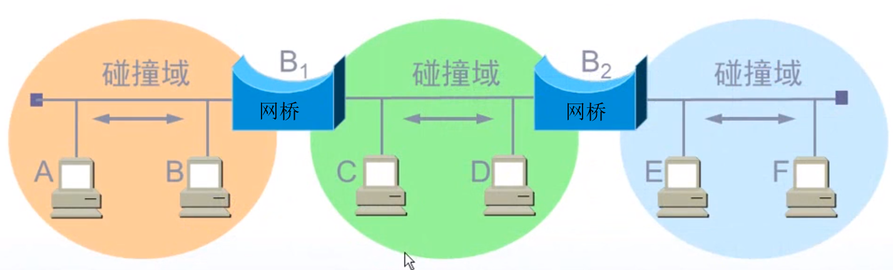

### 局域网设备的演变：总线型网络=>集线器=>网桥=>交换机
#### 总线型网络
```
采用单根传输线作为总线，所有计算机都共用一条总线，特点：当其中一台计算机发送信息给
同一个局域网中另一台计算机时，信息会以广播的形式发送到局域网中所有的计算机，这些
计算机会将目标地址与其本身相同的信息接收，不相同的信息则拒绝接收
```
#### 集线器
```
将总线型网络改造成了星型网络，其实只是在物理上表现成星型网络，逻辑上仍然是总线型网络
总线型网络缺点：多台计算机同一时间内只能有一台计算机发送信息给其它计算机，如果多台计算机
              同时发送则会产生冲突，并且在这种网络下的计算机只能是半双工通信
              
```
#### 网桥
```
局域网的扩充：多个集线器一起连接到一个集线器上，从而扩充了局域网，但同时使得每一个集线器单独的
冲突域变成了多个集线器合在
             一起的大的冲突域。 
网桥：用于解决集线器来进行局域网扩充的问题，隔离冲突域, 从而解决了扩充局域网下集线器冲突域变大的问题，
      网桥通过自学习算法记录一个MAC地址属于哪个网段，下次则可以直接将数据发送到这个接口属于的网段，
      减少了广播的范围。               
```

   

#### 交换机(存储转发)
```
交换机内部的CPU会在每个端口成功连接时，通过将MAC地址和端口对应，形成一张MAC表，在通信时，
只将数据报发送到指定MAC地址的计算机，从而避免了大量广播。
```