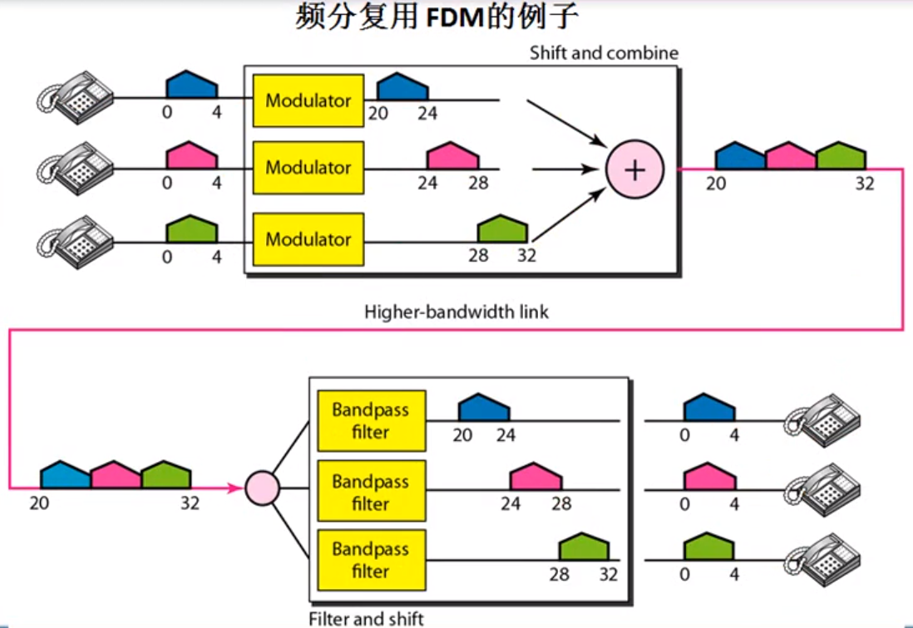
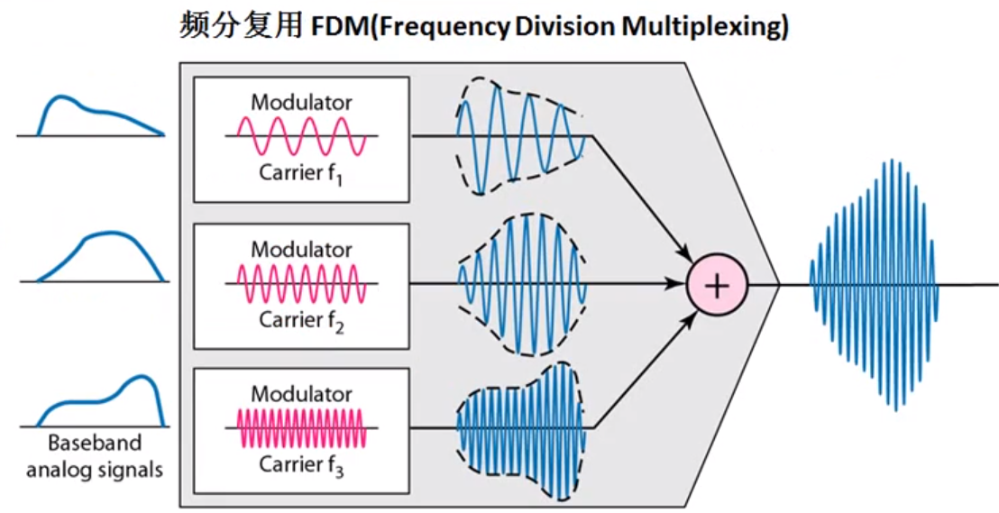
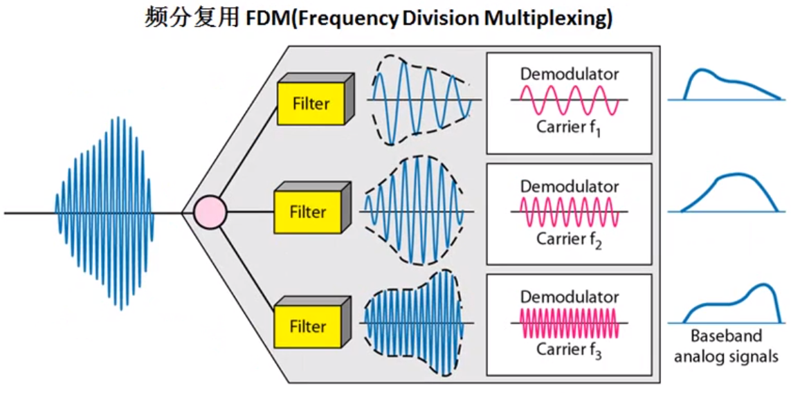
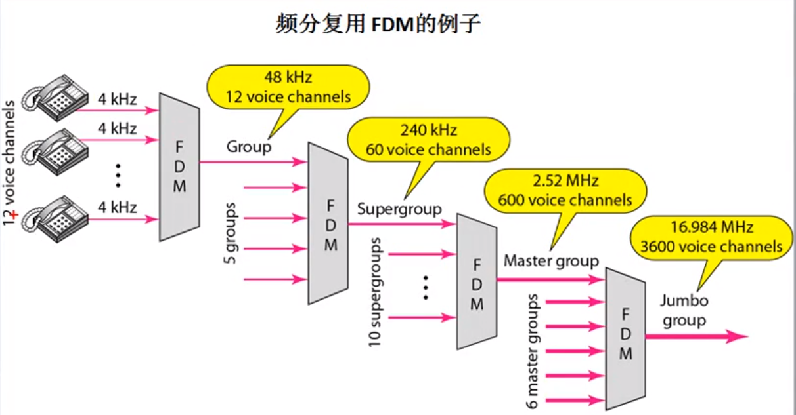
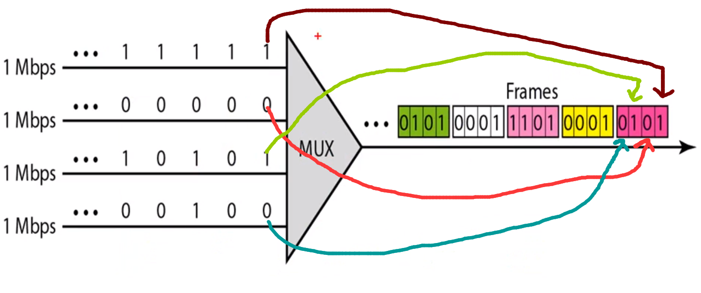
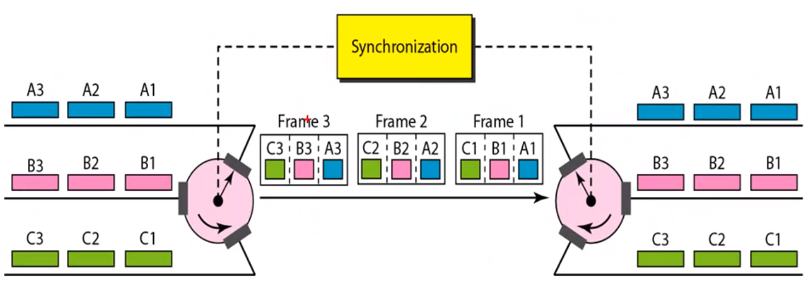
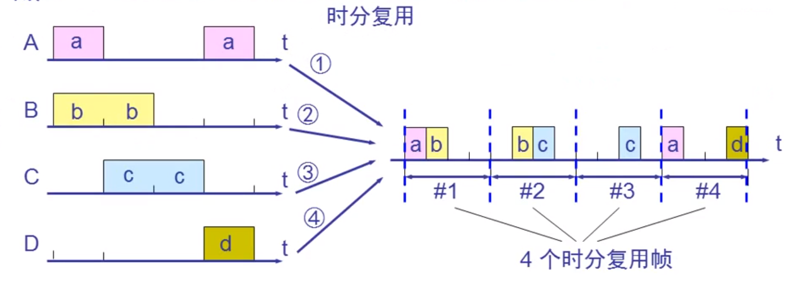
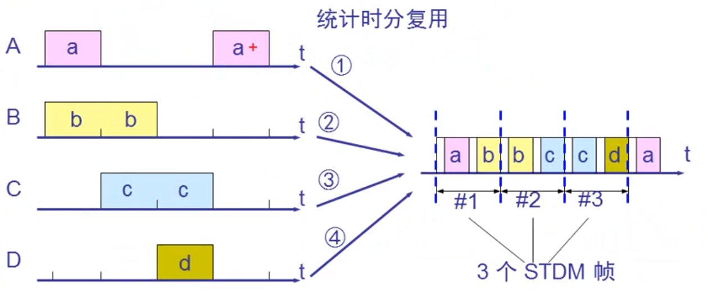
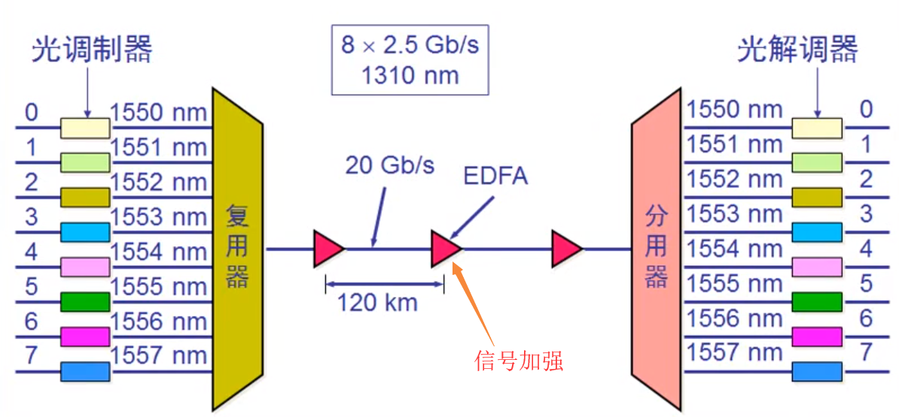

#### 频分复用FDM: 用于打电话, 并且可以多次频分复用, 到达目的地后进行过滤和分用
```
不同的人之间的进行通话:如A-B, C-D, E-F 对A,B,C三者的声音采用不同的频率去进行声音的描述, 
然后将这些频率经过调制, 从而在传输过程中不容易衰减, 然后对这些调制后的频率叠加成一个总的
频率表示, 最后在一个信道中进行这个频率的传输, 到达目的地后通过过滤器进行过滤, 过滤完后再
进行解调, 解调完后对频率进行还原, 此为分用。
```

  



#### 多次频分复用

 

#### 时分复用TDM
```
弊端: 可能会造成线路资源的浪费, 使用时分复用系统传送计算机数据时, 由于计算机数据的突发性质,
      用户对分配到的子信道的利用率一般是不高的。
```

 
 
 

#### 统计时分复用STDM: 对时分复用进行优化, 只接收有效值, 并对这些有效值进行标记, 这样接收方才能识别

 

#### 波分复用WDM：光的频分复用

 

#### 宽带接入技术      
```
ADSL上网实现机制: DMT技术
    利用电话线来同时进行打电话的信号和网络信号的传输, 其中用到的技术是频分复用技术, 电话线本身实际
    可通过的信号频率假设为1MHz, 那么将0-4kHz的频率给电话使用, 将40kHz-1100kHz给网络使用, 其中给
    网络使用的频率又进行细分, 将其分为多个信道, 因为上网主要的流量传输在于下载, 而对网页等请求则为上传,
    上传用的流量是比较小的, 所以将这些信道中的25个用于上行信道, 249个用于下行信道, 所以这也是ADSL叫
    非对称数字用户线路的意思, 即提供的上行和下行宽带速率不对称             
光纤同轴混合王HFC: ADSL是复用电话线进行网络的数据通信, 而该技术是复用有线电视的同轴电缆, 
                  同样是使用频分复用来对电视信号和网络信号进行分发 
FTTH技术(光纤到家)：直接将网络进行光纤传输, 不复用电话线和电视线, 还有光纤到大楼, 到路边
```