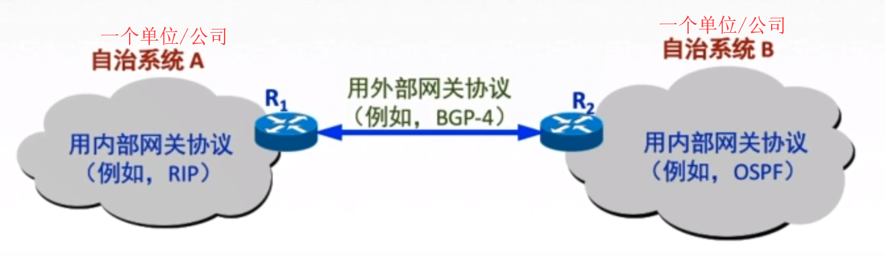
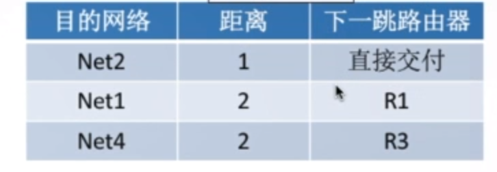

#### 动态路由算法
```
链路状态路由算法(全局性)OSPF: 所有路由器掌握完整的网络拓扑和链路费用信息
距离向量路由算法(分散性)RIP: 路由器只掌握物理相连的邻居及链路费用
```
#### 分层次的路由选择协议
```
原因：
    <1> 因特网规模很大
    <2> 许多单位不想让外界知道自己的路由选择协议, 但还想连入因特网
自治系统AS: 在单一的技术管理下的一组路由器, 而这些路由器使用一种AS内部的路由选择协议和共同的
           度量以确定分组在该AS内的路由，同时还使用一种AS之间的路由协议以确定在AS之间的路由。
           一个AS内的所有网络都属于一个行政单位来管辖，一个自治系统的所有路由器在本自治系统内都
           必须连通 
内部网关协议IGP：一个AS内使用的RIP、OSPF
外部网关协议EGP：AS之间使用的BGP
```

 

#### RIP协议
```
RIP协议: 是一种分布式的基于距离向量的路由选择协议，优点是简单，跳数最多包含15个路由器
        所以距离为16则表示网络不可达。其应用层协议, 使用UDP传送数据
特点：
    <1> 和谁交换信息？RIP协议仅和相邻路由器交换信息    
    <2> 交换什么？路由器交换的信息是自己的路由表
    <3> 多久交换？每30交换一次路由信息, 然后路由器根据新信息更新路由表。若超过180s没收到邻居路由器的通告
        则判定邻居没了，并更新自己路由表
```   

 

#### OSPF协议
```
特点：
    <1> 和谁交换信息？使用洪泛法向自治系统内所有路由器发送信息，即路由器通过输出端口向
        所有相邻的路由器发送信息，而每一个相邻路由器又再次将此信息发往其所有的相邻路由器,
        类似于广播的形式
    <2> 交换什么？发送的信息就是与本路由器相邻的所有路由器的链路状态(本路由器和哪些路由器相邻
        以及该链路的度量/代价---距离、时延等)
    <3> 多久交换？只有当链路状态发生变化时，路由器才向所有路由器洪泛发送此信息
最后，所有的路由器都能建立一个链路状态数据库，即全网拓扑图，就是一个图，通过对图进行求最短路径，
从而可以得到该路由器到任意一个路由器的最短路径
```
#### BGP协议    
```
特点：
    <1> 和谁交换信息？与其它AS邻站的BGP发言人(边界路由)交换信息
    <2> 交换什么？ 交换的网络可达性的信息, 即当前AS可以到达哪些AS
    <3> 多久交换？ 发生变化时更新有变化的部分
```