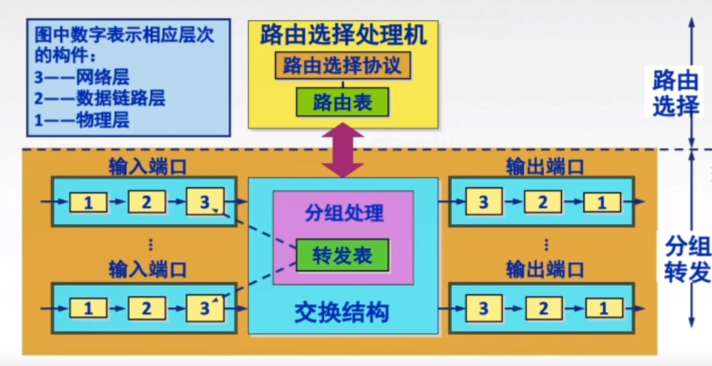
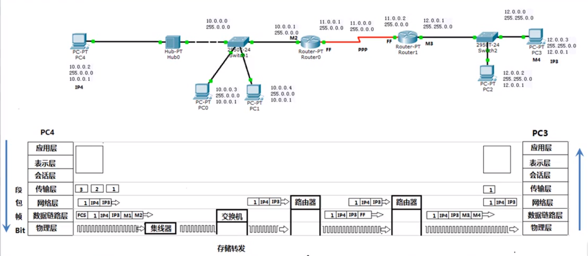

### 网络层设备路由器
```
路由器：是一种具有多个输入端口和多个输出端口的专用计算机，其任务是转发分组
组成：
    路由选择处理机：根据所选定的路由选择协议构造出路由表，同时经常或不定期地
                   和相邻路由器交换路由信息而不断地更新和维护路由表
    交换结构：根据转发表对分组进行转发
    路由表和转发表：路由表是由路由选择算法构造成的，不同的路由选择协议构造成的
                   路由表不相同，而转发表是由路由表得来的，转发表的每一行必须
                   包含到达目的网络的输出端口和某些MAC地址的映射                
收到RIP/OSPF分组等：将分组送往路由选择处理机
收到数据分组：查找转发表并将该转发表输出        
```

 

### 计算机通信的过程
```
应用层: 获得信息并加密后发往传输层
传输层: 对信息进行分段, 将一个信息分为多个段, 并对每一个段都添加一个标记
网络层：对信息添加源IP地址和目标IP地址(这两个信息在整个传送过程中不会发生改变)
数据链路层: 当数据链路层收到这个信息后, 会添加FCS帧检验序列和帧头帧尾, 然后查看
           然后利用自身的子网掩码与源IP地址和目标IP地址分别作与运算
           情况一:
                如果求得两个IP地址在同一个网段, 那么就会利用ARP协议(网络层协议)
                对整个局域网的计算机发送广播, 询问哪台计算机的IP地址是xxx, 并获得该
                计算机的MAC地址, 进而封装到帧里面
            情况二:
                如果求得两个IP地址不再同一个网段, 那么也会利用ARP协议(网络层协议)
                对整个局域网的计算机发送广播, 询问哪台计算机的IP地址是网关(192.168.1.1),
                并获得该计算机MAC地址, 进而封装到帧里面
物理层：对比特流的传送
至此为止, 源计算机已经将数据发送出去, 此时由交换机进行接收, 交换机是一个二层设备, 因为其认识
MAC地址, 会根据MAC地址来进行转发到路由器(网关)或者同一局域网内的计算机
如果发送的数据包目的地址不在同一个网段, 并且源地址是私有地址时, 则到达发送端第一个路由器需要
网络地址转换NAT转换源地址为一个公网IP地址
```

 