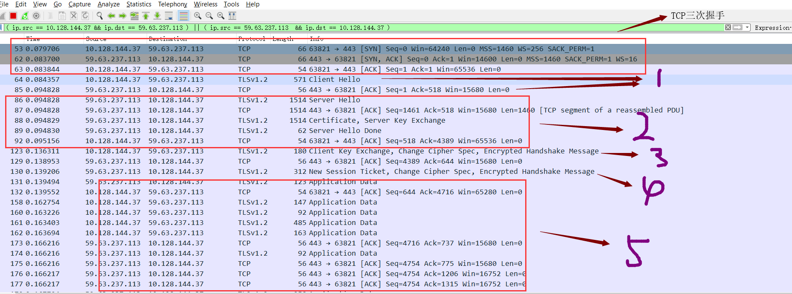

> 在谈及HTTPS之前我们先来对几个概念再进行一番叙述

## 加密算法
```
对称加密算法: 加密解密都公用一对密钥, 优点是加密速度快, 但是需要通信双发都已经拥有该密钥
非对称加密算法: 分为公钥和私钥, 可以用公钥加密私钥解密, 也可以用私钥加密公钥解密, 缺点是对于文件较
               大时加密速度会很慢, 优点是公钥可以给任何人, 因为只能用私钥进行解密

两种加密算法都各有优点和缺点, 对于对称加密来说, 必须只让通信双方才拥有密钥才能达到安全, 通过网络将
密钥传输给对方时仍然有可能会被中间人窃取, 从而导致不安全, 对于非对称加密来说, 虽然在安全性上提高了
很多, 但是加密解密的时间过长, 目前HTTPS采用的是两者结合的方式, 通过非对称加密算法来将对称密钥传输
给对方, 之后的通信采用对称密钥来进行加密解密
```

## 粗略的谈一下HTTPS加密解密的过程
```
假设现在客户端需要将数据传输到服务器, 采用HTTPS通信, 首先服务器端需要生成非对称密钥中的公钥和私钥,
然后将公钥传送给客户端, 客户端收到之后生成对称密钥, 将这个对称密钥用服务器发送过来的公钥进行加密, 然
后将加密后的数据传送给服务器, 由于公钥加密的数据只能私钥解密, 而只有服务器才拥有私钥, 所以当服务器
收到了该数据后, 会用私钥对数据进行解密, 然后获得对称加密的密钥, 之后客户端和服务器的通信就可以通过
该对称密钥来进行加密通信了
```

## 存在的问题
```
如果中间人在服务器发送公钥X给客户端的时候进行劫持, 中间人获得服务器的公钥X, 同时中间人生成自己的非
对称加密的公钥A和私钥B,伪造服务器将这个生成的公钥A发送给客户端, 然后客户端用这个公钥A对自己生成的对
称加密的密钥进行加密, 然后发送给服务器, 此时中间人得到这个信息, 用自己的私钥B进行解密, 得到客户端的
对称加密密钥, 然后再用服务器的公钥A对该对称加密的密钥进行加密后发回给服务器, 此时客户端, 中间人, 服
务器均拥有该对称加密的密钥, 所以中间人也能够窃取信息

总结一下, 其实就是客户端没办法识别得到的公钥是否是服务器的公钥而引起的问题
```

## CA证书认证机构
```
CA证书认证机构, 为了能够使得公钥能被识别出来是否是服务器本身的, 服务器开发者需要向CA证书认证机构申请
认证, 提交自己的公钥以及信息, 当证书认证机构认证通过后, 证书认证机构会先生成一个SSL证书, 证书的内容
包括证书颁发机构CA, 证书的有效期, 服务器方的公钥, 证书所有者, 签名, 其中这个签名是证书颁发机构利用
hash单向散列函数对整个证书的内容进行哈希运算生成的(也叫摘要), 并且用证书颁发机构的私钥(证书颁发机构
拥有一套自己的非对称加密算法的公钥和私钥)对该证书进行加密(所以只能由证书颁发机构的公钥才能对该摘要
进行解密)

那么客户端是如何对服务器发过来的公钥进行判断的呢? CA证书认证机构会在OS被安装时就内置在OS中, 并且都
是权威的机构, OS必须对其信任, 内置于OS中的CA认证机构中存在各个认证机构的公钥, 所以服务器获得了证书
后只需要将证书发送给客户端即可, 客户端收到该证书会先判断是哪个认证机构的, 然后取出该CA的公钥, 对证
书的签名进行解密, 然后再利用单向散列函数对证书的内容进行运算, 判断得到的值是否和签名的值是一样的, 如
果一样那么就说明证书没有被篡改, 从而确定了服务器端的公钥的安全性
```

## HTTPS = HTTP + 加密 + 认证 + 完整性保护 = HTTP + SSL外壳
```
综上所述, 我们对HTTP协议的内容进行对称加密算法加密, 而对于对称加密算法产生的密钥则用非对称加密算法
的公钥进行加密, 私钥进行解密, 为了能够确定公钥的安全性, 即为了确定公钥确实是由服务器端发送过来的, 就
需要服务器端向CA申请一个证书, 通过证书的摘要(签名)来保证公钥的完整性以及客户端对公钥的认证
```

## HTTPS抓包分析
```
下面分析HTTPS具体的通信流程, 如下图所示:
1: 客户端发送Client Hello数据包给服务器, 告诉服务器自己支持的加密算法以及SSL的版本, 服务器收到后
    会回应一个ack确认包
2: 服务器从客户端发来的Client Hello包中选择一个SSL版本和加密算法, 然后通过发送Server Hello包给客
   户端告知自己的选择, 之后服务器发送一个Certificate包给客户端, 该包的作用是将服务器的CA认证证书
   发送给客户端, 之后发送Server Hello Done包给客户端表示第一阶段的信息交换结束可, 客户端收到该证
   书后会进行验证证书的安全性, 并且从中获得服务器的公钥
3: 客户端生成一个随机数(用于生成对称加密算法的密钥), 将该随机数用之前客户端收到的公钥进行加密, 加密
    后再将该数据发送给服务器, 即发送Client Key Exchange包, Change Cipher Spec的意思是客户端告知
    服务器后面讲会用该随机数生成的对称密钥进行加密数据
4: 服务器收到客户端发来的随机数后, 用自己的私钥进行解密, 获得对称密钥算法的密钥, 然后同样利用Change
   Cipher Spec告诉客户端之后将用这个对称密钥进行数据加密

至此为止, 通过CA证书来实现了服务器的公钥安全的到达客户端, 并且客户端安全的利用该公钥加密对称密钥并
发送给服务器, 双方信息协商完毕, HTTPS密钥交换完毕, 之后的第5步则是利用HTTPS通信的过程, 数据进行了
加密后传送
```




