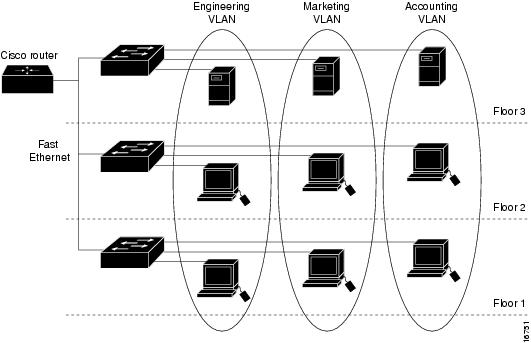

### VLAN虚拟局域网
```
VLAN的表示：
    交换机的使用使得VLAN的创建成为可能，首先由下图所示: 三层楼中每一层都有一个交换机，
    每层楼的计算机本应该在该层楼的交换机下构成一个局域网，现在需要将三层楼中同一列的
    计算机之间才构成局域网，但是每一层楼的计算机都连接在其自身层的交换机上，此时需要
    利用VLAN技术，将同一台交换机分割成三个逻辑的局域网，即VLAN，利用接口来区分，比如
    1-10口为VLAN1，11-20为 VLAN2，21-30为VLAN3，这样一台交换机就分成了三个局域网，
    但是不同楼的需要通过交换机中的干道链路连接起来，就是交换机A与交换机B通过干道链路的
    线连接起来，这个干道链路可以通过多个网段(局域网)的信息当交换机A中接在1口的计算机与
    交换机B中接在5口的计算机(由于都属于VLAN1，所以是局域网)通信时，会将数据进行封装，添加ISL
    标记来在干道链路上传输时区分属于哪个VLAN，从而发送到指定的计算机
```

   