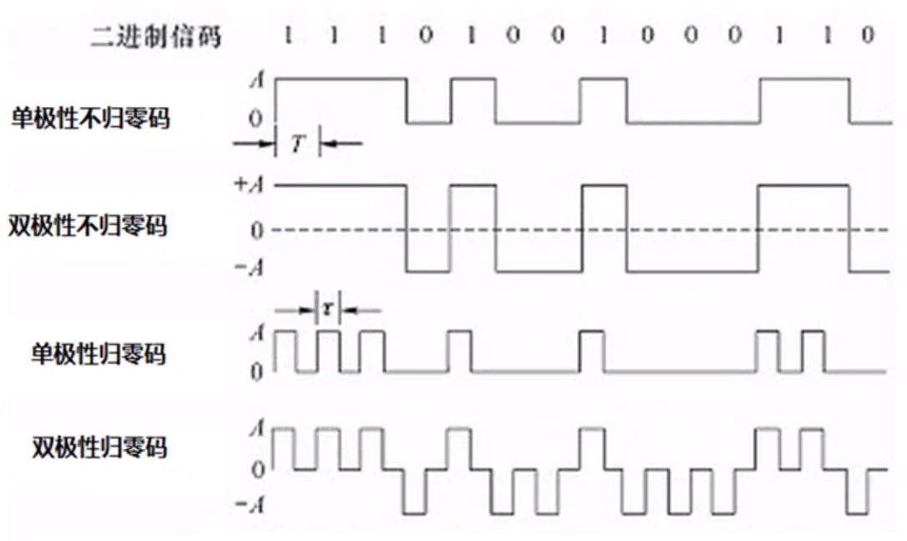
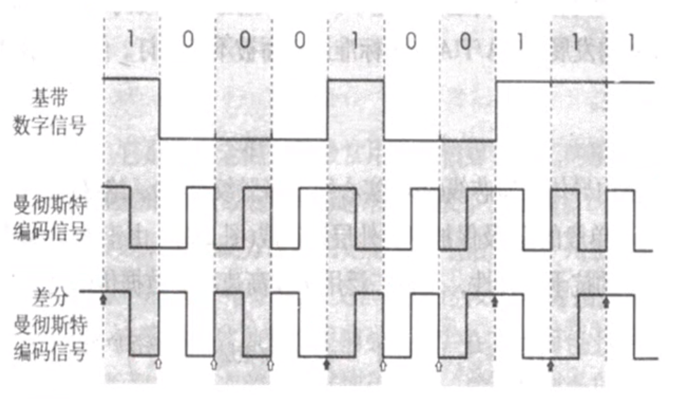
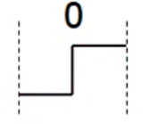
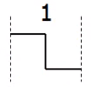
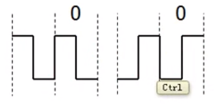
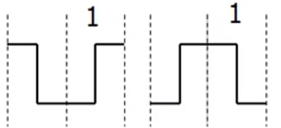

#### 常用术语
```
通信的目的：传送消息
数据：运送消息的实体
信号：数据的电气的或者电磁的表现
    "模拟信号" 代表消息的参数的取值时连续的
    "数字信号" 代表消息的参数的取值是离散的
码元: 在使用时间域的波形表示数字信号时, 则代表不同离散数值的基本波形就称为码元。
      在数字通信中常常用时间间隔相同的符号来表示一个二进制数字, 这样的时间间隔
      内的信号称为二进制码元。而这个间隔被称为码元长度。一码元可以携带nbit的信息量
      
```
#### 信道
```
概念: 一般是用来表示向一个方向传送信息的媒体
信道中通信的方式: 
    - 单向通信(单工通信): 只能由一个方向的通信而没有反方向的交互, 例如电视机
                         接收电视信号, 只能由电视台那边发送信号过来
    - 双向交替通信(半双工通信): 通信的双方都可以发送信息, 但不能双方同时发送,
                              也不能同时接收。例如对讲机
    - 双向同时通信(全双工通信): 通信的双方可以同时发送和接收信息。例如电话
```
#### 基带信号&带通信号
```
基带信号(在数字信道上传输): 来自信源的信号。像计算机输出的代表各种文字或图像文件的
                          数据信号都属于基带信号。基带信号就是发出的直接表达了要
                          传输的信息的信号, 比如我们说话的声波就是基带信号, 再比如
                          由物理层发出的二进制比特流也是基带信号
                          
带通信号(在模拟信道上传输): 把基带信号经过载波调制后, 把信号的频率范围搬移到较高的频段
                          以便在信道中传输

在传输距离较近时, 计算机网络都采用基带传输方式, 由于近距离范围内基带信号的衰减不大, 
从而信号内容不会发生改变。如计算机到监视器、打印机等外设的信号就是基带传输的, 而在
网络上传输时, 由于传输距离较远(如北京到上海), 此时为了能够防止信号衰减严重, 需要将
基带信号调制成带通信号来在模拟信道上传输 
```

#### 基带信号的编码
```
编码的原因: 由于计算机传送的是二进制数据01, 那么在网络中传输时需要将其转换成电磁波来
           进行传输, 则用多大的电压来表示一个0和一个1就是对基带信号进行编码。
            
编码方式:
    单极性不归零码: 只使用一个电压值, 用高电平表示1, 没电压表示0
    双极性不归零码: 用正电平和负电平分别表示二进制数据的1和0, 正电平和负电平的值是相等的
    单极性归零码: 以高电平和零电平分别表示二进制码1和0, 而且在发送码1时高电平在整个码元
                 期间T只持续一段时间x, 其余时间返回零电平(例如 11, 则其应该是连续的两个
                 高电平信号, 但是每一个高电平信号代表完1后立马恢复成零电平, 然后再跳到
                 高电平, 再恢复成零电平)
                
    双极性归零码: 正负零三个电平, 正电平代表1, 负电平代表0, 每代表完一个1和0都要跳转到零电平      

    不归零编码特点：编码容易, 但是没有检错功能, 无法判断一个码元的开始和结束, 以至于收发双方
                   难以保持同步, 例如发送10个1, 则收方收到的是一连串的高电平, 从而无法判断多少个1
                   
    曼彻斯特编码: 信号由低跳到高, 则高电平代表0, 信号由高跳到低, 则低电平代表1, 如果两个信号之间
                没有进行跳转, 则两个信号的电平是一样的, 则说明没有网络(需要取样两次)
                
    差分曼彻斯特编码: 如果后一个是0则将后一个的电平和前一个保持一致, 如果后一个是1, 则将后一个的电平
                    进行跳变,比如两个连续的11, 其电平的表示方式是不一样的, 因为要进行跳变                    
```




- 基带信号

    

- 曼彻斯特编码

    
    

- 差分曼彻斯特编码

    
    

#### 基带信号的调制(将数字信号转换为模拟信号) 
- 调幅: 载波的振幅随基带数字信号而变化

    
- 调频: 载波的频率随基带数字信号而变化

    
- 调相: 载波的初始相位随基带数字信号而变化(对二进制0用开始从中点向上, 结束时从下到中点的波表示, 
        对二进制1用开始从中点向下, 结束时从上到中点的波表示)

    

#### 奈氏准则
```
奈氏准则: 在任何信道中, 码元传输的速率是有上限的, 否则就会出现码间串扰的问题, 使接收端对码元的识别
         成为不可能, 即当传输速率过快的时候, 一个码元的大小(宽度)就会变得很短, 如___变为了_ , 
         那么识别速度一定的情况下就可能导致识别失败, 如果信道的频带越宽, 也就是能够通过的信号高频
         分量越多, 那么就可以用更高的速率传送码元而不出现码间串扰
         
一句话: 奈氏准则告诉我们即使是没有干扰的情况下, 传输速率也是有上限的
```
#### 香农公式
```
香农公式: C = W * log(1 + S/N) b/s
        C：信道的极限传输速率, 即在带宽一定, 有噪声干扰的信道下, 能达到的极限、无差错的信息传输速率
        W：信道的带宽
        S：信道内所传信号的平均功率
        N：信道内部的噪声功率

例子1: A对B面对面说200个字, 在没有噪声干扰的情况下, 此时A的说话速度(带宽)能够让B无差错的听到说的话, 
      此时突然传来了工地的施工声音, 噪声很大, 为了能够让B无差错的听到这200个字, A需要降低说话的速度
      (带宽)才能达到
    

例子2: 电脑与WIFI路由器的距离为2米, 此时可以通过看网络状态信息中速率很高, 当电脑与WIFI路由器之间隔了
       一道墙, 或者一个房间此时为了达到无差错的信息传输, 需要降低传输速率

香农公式表明:
    <1> 信道的带宽(W)或信道中的信噪比(S/N)越大, 则信息的极限传输速率就越高
    <2> 只要信息传输速率低于信道的极限信息传输速率, 就一定可以找到某种方法来实现无差错的传输
    <3> 若信道带宽W或信噪比S/N没有上限(不可能), 则信道的极限信息传输速率C也就没有上限  
```
#### 基于香农公式提高传输速率
```
问题: 
    奈氏准则告诉我们传输速率是有上限的, 香农公式告诉我们带宽的大小和信噪比能够影响极限传输速率, 
    那么在带宽已经确定的信道, 以及信噪比不能再提高时, 怎么去提高传输速率呢?

解决方案:
    用编码的方式让一个码元携带更多的比特, 例如: 加入我们的基带信号为 101011000110111010..., 如果
    直接传送, 则每一个码元所携带的信息量是1bit, 而编码是将二进制编制成一定的相位(如果为相位调制), 
    那么将3个比特作为一组, 即101, 010, 000, 110, 111, 010..., 3个比特共有8种情况, 则用8种不同的
    相位进行调制, 那么原来用18个码元才能表示的数据就用6个码元就可以表示了, 这样以相同速率去传送码元
    (带宽一定), 信噪比又一定的情况下, 就极大的提高了传输速率, 即使得传输速率无限的接近香农公式的值
```