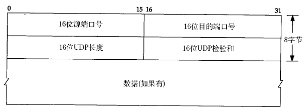

### UDP协议
```
特点：
    <1> UDP协议是面向无连接的协议, 通信双方在发送数据之前不用建立连接
    <2> UDP协议是面向报文的协议, 直接将应用层传过来的数据进行封装成用户数据报,
        然后往网络层传输, 所以应用层传过来的数据的大小需要在一定范围内, UDP协议
        不能对数据进行分段
    <3> UDP协议无拥塞控制, 适合很多实时应用, 如多播    
    <4> UDP使用最大努力交付, 即不可靠交付

首部格式：源端口 目标端口 长度(整个用户数据报的大小) 检验和(对整个数据报进行检验)
```


