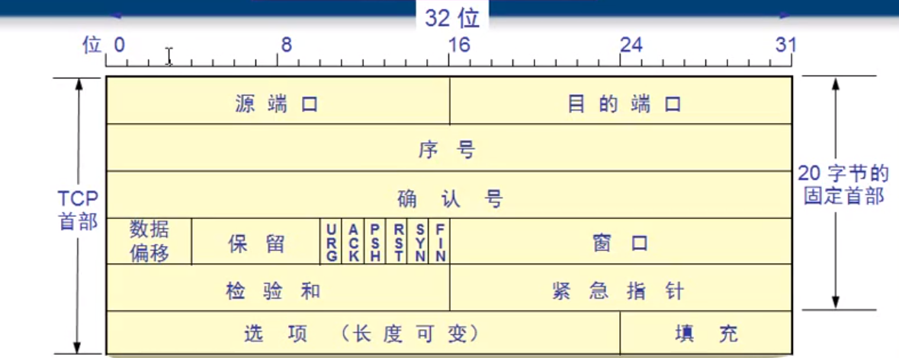
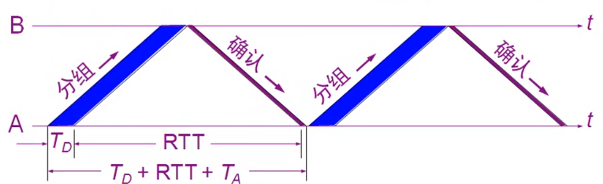
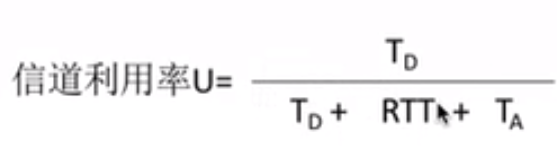
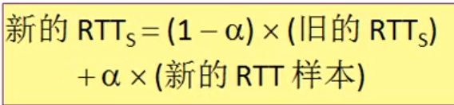

#### 特点
```
特点：
    <1> TCP是面向连接的协议, 提供可靠的传输, 能达到数据无差错, 有序
    <2> TCP协议是全双工通信
    <3> TCP协议是面向字节流的协议(TCP协议封装报文段的时候是从发送缓存中读取一定数量的字节来封装)
    <4> 每一条TCP连接都是点到点的
```
#### TCP协议首部格式
```
TCP协议的首部由20个字节的固定部分和可变部分(选项+填充部分)构成, 类似于IP协议
固定部分：
    源端口/目的端口：表示发送方的应用程序端口和接收方的应用程序端口
    序号: 序号代表了报文段的第一个字节在整个文件中是第几个字节
    确认号: 表示接收方期望发送方下一个应该发送的字节的序号, 同时表示
            在确认号前的所有字节都已经正常接收
    数据偏移: 表示该报文段的数据部分是从第几个字节开始, 同时表示该报文段
             的首部的字节个数
    保留：保留位, 以后可能会用到
    六个标记位：
        URG(urgent): 标识这个报文段是否存在紧急数据, 配合紧急指针使用, 如果
                     为1, 则紧急指针的值生效
        ACK: 标识这个报文段的确认号是否生效
        PSH(push): 表示这个报文段在接受方是否应该优先处理
        RST(reset): 表示TCP连接出现严重错误, 需要释放连接后再重新连接
        SYN(synchronize): 同步位, 该标记位为1用于建立连接, 只有在TCP
                          建立连接的前两次握手才生效
        FIN(finsh): 结束位, 当发送方需要发送的数据全部发送完成时, 释放
                    连接的报文段需要把该位置为1
    窗口：表示该数据报的发送方的接收窗口的容量, 用于告诉发送方发送窗口的最大值
         为该窗口的值(最大的原因是在拥塞控制时, 可能发送窗口小于该值)
    检验和: 整个TCP报文段数据的检验和
    紧急指针：代表数据部分紧急数据的字节个数, 配合URG标记位使用, 只有URG标记位
             为1该紧急指针才生效 
选项部分：一般选项部分在进行SYN同步时才会出现, 比如MSS, WS等
    MSS(Maximum Segment Size): 最大传输报文段(数据部分), 只有在建立连接SYN同步
                                时才会出现, 发送方用于告知接收方其报文段的最大
                                字节数
    window scale(窗口扩大): 当窗口大小不够大, 而发送速率很快时, 会使得发送方发送出
                            很多个报文段后仍然没收到第一个报文段的确认, 从而处于等待
                            扩大窗口可以使得发送方一直在发送信息, 减少等待, 一般在建立
                            连接时会协商, 不需要时则置为0从而恢复窗口大小
    SACK(选择确认选项)：当连续的一段数据丢失了其中一个时, 比如1,2,3,5,6, 丢失了第四个, 利
                       用该选项可以在返回确认号为4的同时允许发送方不发送5,6等已经接收的值
    时间戳选项：用于计算往返时间RTT
    NOP(no option): 无意义选项                                               

填充：当选项部分的数据不是4字节的整数倍时，填充字段会利用0填充到4字节的整数倍
```



#### TCP可靠传输
##### 停止等待协议
```
为了更好的理解可靠传输的滑动窗口机制, 先以简单的体制等待协议来进行讲解
停止等待协议: 只有发送方收到接收方的确认信息才发下一个数据包
会出现的四种情况:
    <1> 无差错情况
    <2> 超时重传(时间略大于往返时间)
    <3> 确认丢失: 接收方会收到重复的包, 丢弃所有的只剩下一个, 并重传确认
    <4> 确认迟到：收到迟到的确认, 但是什么也不做, 因为之前已经将其超时重传了
缺点：信道利用率太低, 发送方发送了一个数据后就处于等待确认状态, 只有等到了确认信息
     才继续传下一个数据, 大部分时间在等待, 而发送时间却很短

如下图所示: 停止等待协议时间的分配, TD表示将一个数据包的发出去的时间, RTT是往返时间,
           TA是收取确认数据包的时间
如下第二张图所示: 信道利用率公式    

根据这两张图片, 我们发现需要提高TD, 只有提高了这个才能够使得信道利用率高, 方法就是同一时间
发送多个报文段, 而不是等第一个报文段确认后才发送下一个

```





##### 滑动窗口技术
```
累计确认: 如果收到了1,2,3,6字节, 那么其应该确认收到的是第3个字节, 让发送方发送第4个字节
    优点是：容易实现，信道利用率提高了
    缺点是：不能向发送方反应出接收方已经正确收到的所有分组的信息(利用SACK选择确认来避免)

滑动窗口技术：
    前提准备：B计算机从A计算机中下载文件, 已经经过了三次握手建立连接, 双方已经互相交换了信息
             假设A计算机和B计算机协商的是B计算机的接收窗口是20, 所以A计算机的发送窗口也是20
    正常情况：
            A计算机读取了60个字节到发送缓冲区, 此时其维护了一个20个字节的发送窗口, 那么就将前
            20个字节放入发送窗口中, 然后TCP开始封装数据段, 第一个取出3个字节, 第二次取出4个字节, 
            第三次取出13个字节, 并依次加入TCP首部形成数据段, 然后依次发送。
            B计算机维持了一个指定大小(例如80)的接收缓冲区, 以及一个20个字节的接收窗口, 假设此时
            接收到了123,4567两个数据段, 由于可以累积确认, 所以其回复一个报文, ack=8, 告知A计算机
            可以开始发送第8个字节的数据了, 此时A计算机收到这个确认信息后就会将前7个字节的数据从发送
            窗口以及发送缓冲区中移除, 然后发送窗口往右移动, 此时其维持的数据是从8-28字节的数据
            
    存在丢失的情况：
            A计算机读取了60个字节到发送缓冲区, 此时其维护了一个20个字节的发送窗口, 那么就将前20个字节
            放入发送窗口中, 然后TCP开始封装数据段, 第一个取出3个字节, 第二次取出4个字节, 第三次取出13
            个字节, 并依次加入TCP首部形成数据段, 然后依次发送。
            B计算机维持了一个指定大小(例如80)的接收缓冲区, 以及一个20个字节的接收窗口, 假设此时接收到
            了123,8-20两个数据段, 说明了4567这个数据段在发送过程中丢失了, 此时应该回复一个确认号为4的
            信息, 但是因为已经接收了8-20的字节信息, 所以其应该利用首部可选字段的SACK选择性确认字段来告
            知A计算机只需要发送4-7字节的数据就好了, 这样A计算机就重发4-7字节的数据段, 而不再发送8-20
            字节的数据段了。如果B计算机返回给A计算机的确认报文段丢失了, 那么在一个超时时间之后, A会重新
            发送一个该报文段, 直到收到了B计算机的确认, A计算机才会将这个报文段的字节数据从发送窗口和发送
            缓冲区中移除
```
##### 窗口与缓冲区
```
发送缓冲区和发送窗口：
    发送窗口中保存了已经发送但是没有收到确认的内容, 而发送缓冲区中保存了已经发送但是没有收到确认的内容
    以及还未发送的内容。
接收缓冲区和接收窗口:
    接收窗口保存了已经接收但是未按序到达的字节数据, 比如接收窗口中有字节为12456, 所以其返回一个确认报文段
    后窗口右移从而使得有一个位置空出来给3号字节, 12号字节不再纳入其中, 而接收缓冲区中保存了已经接收但是还
    未被应用程序处理的内容以及接收窗口的内容
拥塞窗口：发送方根据自己估算的网络拥塞程度而设置的窗口值，反应网络当前容量
因为TCP存在拥塞控制, 所以其发送窗口需要根据接收方的接收窗口的大小和拥塞窗口来确定
即发送窗口：Min(接收窗口, 拥塞窗口)    
```
##### 超时重传时间的选择
```
加权平均往返时间RTTs: 指的是多个数据包(例如10个)的往返时间RTT的平均值
不能老用旧的平均往返时间：所以需要不停的更新
```



#### TCP的流量控制
```
当发送方A的速率很快, 接收方B的处理数据的速度较慢时, 需要进行流量控制, B计算机通过将接收缓冲中的数据
读取出来拼凑成一个文件, 当B计算机处理这些数据时很慢, 然后发送方仍然在发送数据, 此时发现缓冲中数据
已经满了, 就仍然发送一个数据包, 告诉发送方应该发送的下一个字节是什么, 但是此时这个包里面的窗口大小
就是0了, A收到数据包后看到窗口大小是0, 就应该调整自己的发送窗口的大小为0, 此时发送窗口没用数据, 就
处于等待状态, 直到B计算机处理完缓存中的数据时, 就告知A计算机应该发送的下一个字节是什么, 并且窗口
大小重新调整为一个大于0的值, 但是这个包有可能会丢失, 所以为了防止这个情况， A计算机也应该定时的
发送一个询问的包来看看B计算机的接收窗口是否还是0, 当不为0的时候, 又开始正常的数据交换了

总结一句话: 接收端通过动态的调整接收窗口的大小来实现流量控制, 发送端的发送窗口因为要同步接收端的接收窗口
           所以当接收窗口为0时, 发送方也发送不了数据了
```
#### TCP的拥塞控制
```
拥塞控制描述：
    出现资源拥塞的条件：对资源的需求总和 > 可用资源
    拥塞控制是一个全局性的过程, 涉及到所有的主机、所有的路由器, 以及与降低网络传输性能有关的所有因素
发送窗口：Min(发送窗口的大小, 拥塞窗口的大小)
```
##### 慢开始算法&拥塞避免
```
描述：
    慢开始算法指的是发送方初始设定一个很小的发送窗口值, 这个值必须小于接收方在同步报文段中提到的
    接收窗口大小, 一般是从1开始, 开始发送后, 每收到一个报文段的确认信息, 就将窗口值加1, 由此可见
    初始窗口大小为1, 当收到这个报文段得确认后, 窗口大小变为2, 之后发送了两个报文段后, 都收到回复时
    窗口大小就会变为4, 依次类推, 可以看到窗口大小的变化是1,2,4,8,16..呈指数增加的, 当窗口大小增大
    到一个门限值的时候, 此时可以认为是有点拥塞的情况, 采取拥塞避免的方法, 使得没经过一个RTT时间只增
    加一个窗口大小, 当到达了拥塞状态(超时)后, 将窗口值置为1, 门限值置为原来的一半, 重新开始慢开始算法。
注意：
    <1> 这个窗口的大小的计算方式虽然是刚开始倍数增加, 后来线性增加, 但是窗口大小必须小于接收方提供的
        接收窗口的大小: Min(发送窗口的大小, 拥塞窗口的大小)
    <2> 通过报文段是否超时来判断达到了拥塞状态, 当一个数据报出现了超时的时候, 就说明达到了拥塞状态,
        从而发送方需要重传这个报文段, 并且重新执行慢开始算法。    
```


##### 快重传&快恢复算法
```
描述：由慢开始算法以及拥塞避免可知, 通过超时来判断是否达到拥塞状态, 那么就会存在一种情况, 当时的
     网络并不拥塞, 一个报文段可能丢失了, 从而让发送方误以为网络拥塞, 从而提前进入了慢开始算法, 将
     发送窗口置为了1, 这个时候就会导致资源充足, 没有得到充分利用的情况。     
     
     解决办法是快重传, 当接收方收到了一个报文段之后, 立马回复一个确认报文段, 例如接收方收到了1,2,4
     报文段,对1,2报文段会立马发送确认, 而因为丢失了3报文段, 即使收到了4报文段, 接收方本可以什么都不做,
     但是快重传规定必须立马回复, 但是此时这个回复中的确认号是3, 这样在收到了1,2,4,5,6报文段后, 就会连续
     回复三个确认号为3的报文段, 接收方能够收到三个重复报文段, 就不会认为网络发生了拥塞从而不用进入慢开始
     算法。以下面图中连续收到3个重复的确认位置来看, 此时采用快恢复的算法, 将门限值设置为原来的一半, 并将
     拥塞窗口的值设为这个门限值, 重新开始执行线性增加。
```

