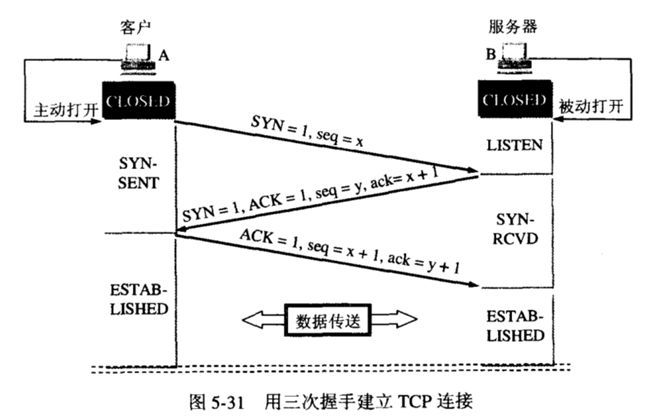

#### TCP的运输连接管理: 连接建立、数据传送和连接释放
##### 三次握手建立TCP连接
```
TCP协议规定: 同步报文段(即SYN=1)不允许携带任何的数据, 但是要消耗一个序号
<1> A计算机发送一个同步报文段到B计算机, SYN=1, seq=x(不允许携带数据),
    此时A计算机进入SYN-SEND状态
<2> B计算机向A计算机发送一个确认报文段, SYN=1, ACK=1(确认号生效), seq=y,
    ack=x+1(不允许携带数据), 此时A计算机进入SYN-RCVD状态
<3> 计算机开始向B计算机发送数据, ACK=1, seq=x+1, ack=y+1(可以携带数据),
    此时A计算机进入ESTABLISHED状态
<4> B收到这个报文段之后就会进入ESTABLISHED状态    
```
##### 三次握手的原因
```
三次握手的原因是通信双方为了在通信之前能够进行一些参数, 配置信息的交换, 如MSS, WS等
<1> A计算机往B计算机发送了一个同步数据包, B计算机也往A计算机发送了一个同步数据包,
    两个数据包也能够说明A和B计算机通信的参数,如窗口大小以及最大字节长度等
<2> 有这么一种情况, 如果A计算机发送了一个同步数据包, 由于网络原因等, 该数据包在
    超时时间范围内还没有到达, 那么A计算机就会重复发送一个同步数据包给B, 此时B收到了
    后来得这个数据报, 如果没有第三次握手, 那么此时就已经建立了连接, 假设此时A与B之间
    数据交换完毕, 并且释放了连接, 之后第一个同步数据包终于到达了B计算机, B会以为A计算机
    又想跟它建立连接, 所以就会回复一个同步数据包给A, 等待A给它发送信息, 此时A计算机收到
    这个同步数据包后不会进行响应, 因为其并不想跟B建立连接, 从而使得B计算机一直在等待A
    计算机与其进行数据交换, 导致了资源得浪费
<3> 针对上面这种情况, 如果有了三次握手, 那么只有当B计算机收到了A计算机的第二个数据报后
    才正式建立连接, 如果没有收到, 那么B就会重复一个同步报文段到A, 因为有三次握手的存在,
    所以A会去响应这个报文段, 从而发出第三次握手    
```



##### 三次握手引发的隐患及解决方式
```
隐患:
    我们知道, 客户端与TCP发起了第一次握手后, 服务器会对该数据包进行确认,
    所以服务器会返回一个数据包给客户端, 并且进入SYN-RECEIVED状态, 等待
    客户端的第三次握手, 那么就会导致一个隐患, 不停的向服务器发送请求连接
    报文, 同时该请求连接报文的源IP地址是不存在的(客户端不存在), 那么就会
    导致服务器接收大量的请求连接报文, 并响应进入等待状态, 由于这个IP地址
    不存在, 那么服务器就会不停的等待多个不存在的主机进行第三次握手, 从而
    造成资源的浪费
解决方式(其中一种)：利用防火墙
        <1> 客户端往服务器发送SYN包
        <2> 防火墙接收客户端发来的SYN包, 代替服务器发送ACK+SYN包给客户端
        <3> 此时会出现两种情况, 情况一是由于是SYN攻击导致客户端不会回应, 此时
            防火墙则丢弃该连接, 情况二是客户端发送ACK包(第三次握手)给服务器,
            则说明客户端存在, 此时防火墙代替客户端与服务器进行三次握手, 建立连接,
            此时防火墙再发送一个ACK给客户端, 开始传输下一个数据
```

##### 保活机制
```
如果在连接建立之后, 客户端网络出现异常, 单方向断开了连接, 那么TCP协议会存在
保活机制, 在一定时间后没收到客户端的回应, 就会发送探测包给客户端询问, 如果发
送了多个探测包后仍然没有收到回应, 则服务端会主动关闭这个连接
```

##### TCP四次握手释放连接
```
参与一条TCP连接的两个进程中的任何一个都能终止该连接, 连接结束后, 主机中的资源(接收/发送缓存等)将被释放
由于TCP协议是全双工通信, 所以任何一方终止连接后另一方仍然能够继续发送数据, 只有当两方都释放了连接之后才
能正确的结束本次TCP连接

TCP协议规定: FIN报文段不允许携带任何的数据, 但是要消耗一个序号
<1> A计算机往B计算机发送请求释放连接报文段, FIN=1, seq=u, 此时A计算机进入FIN-WAIT1状态(不允许携带数据)
<2> B计算机收到A计算机的报文段后, 需要回复一个确认报文段, ACK=1, ack=u+1, seq=v, 此时
    B计算机进入CLOSE-WAIT状态, 等待关闭
<3> A计算机收到确认报文段后, 进入FIN-WAIT2状态, 从A到B计算机的数据传送单方向结束, 此时B计算机仍然
    可以向A计算机单方向发送数据, 直到发送完毕后进入步骤4
<4> B计算机发送的数据完毕, 会发送一个请求释放连接报文段到A, FIN=1, seq=w, ack=u+1, ACK=1, B计算机进入
    LAST-ACK状态(不允许携带数据), 这个seq之所以等于w而不是v+1, 是因为在步骤三中B仍然可能发送数据给A
<5> A计算机收到B计算机的请求释放报文段后, 会回复一个确认, ACK=1, seq=u+1, ack=w+1, 此时A计算机进入
    TIME-WAIT状态, 直到4分钟后A才进入CLOSED状态
<6> B计算机收到了A的确认后立马进入CLOSED状态       
```
##### TCP四次握手后客户端进入TIME-WAIT状态的原因
```
<1> 因为A计算机的最后一次确认报文段可能会丢失, 如果A在发送出这个报文段后进入CLOSED状态, 那么报文段
    一旦丢失, B计算机就会重发请求释放连接报文段, 而A计算机进入了CLOSED状态后不会响应这个报文, 从而
    使得B计算机会处于一直等待状态, 导致资源的浪费。
<2> 其次是在这个TIME-WAIT时间范围内, A计算机能够处理完B计算机的一些迟到的请求释放连接报文段, 从而不会   
    影响下一次的连接
```


