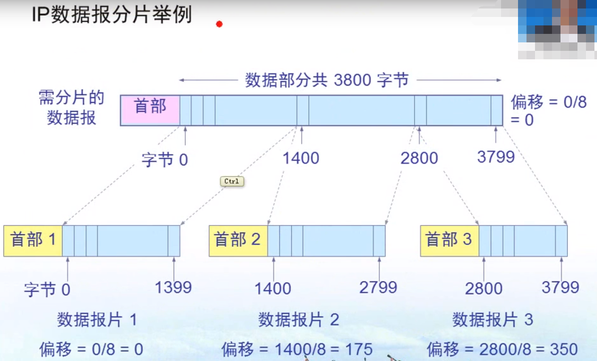

#### IP地址&硬件(MAC)地址
```
IP地址:
    由网络ID(网络部分)和主机ID(主机部分)构成, 同一个网段的第一个IP地址主机部分全是0所以不使用, 
    最后一个IP地址主机部分全是1作为广播地址使用, 每个IP地址全球唯一(除了私有地址)
MAC地址:
    MAC地址可以理解为网卡的地址, 每一个网卡的MAC地址全球唯一
IP地址在计算机通信传送数据包时, 数据包的源IP地址和目的IP地址通信过程中不会发生改变, 而源MAC地址
和目的MAC地址会不停的进行改变, 每一跳都要进行改变, IP地址决定了数据包的起点和终点, 而MAC地址决定
了数据包下一次应该到达的路由器或者主机
```
#### IP地址的分类
```
IP地址表示: xxx.xxx.xxx.xxx
划分的依据: 第一个xxx为0000 0000(0),1000 0000(128),1100 0000(192),1110 0000(224)...
A类地址：第一个xxx是0-126(0000)的地址是A类地址, 默认子网掩码为255.0.0.0
B类地址：第一个xxx是128-191(1000)的地址是B类地址, 默认子网掩码为255.255.0.0
C类地址：第一个xxx是192-223(1100)的地址是C类地址, 默认子网掩码为255.255.255.0
D类地址：第一个xxx是224-239(1110)的地址是D类地址, 用于多播地址的使用
E类地址：第一个xxx是11110000的地址是D类地址, 保留未使用
```
#### 特殊的几个IP地址
```
127.0.0.1 本地回环地址
169.254.0.0 在连接网络后，没有获取到IP地址时，计算机自动分配的IP地址
保留的私网地址(外网是不通的,即互联网中不知道怎么走到这些网络地址):
    A类地址：10.0.0.0
    B类地址：172.16.0.0  --- 172.31.0.0
    C类地址：192.168.0.0 --- 192.168.255.0
```
#### 子网掩码
```
用来指明一个IP地址中哪些位标识的是主机所在的子网以及哪些位标识的是主机的位掩码。
即标识网络部分和主机部分,当在发送数据时, 如果通过子网掩码发现目标地址和源地址在
同一个网段, 则直接将数据包找到指定的MAC地址发送,在同一个网段则通过路由转发
```
#### 子网掩码求网段
```
已知IP为192.168.10.127, 子网掩码为255.255.255.0, 利用IP地址与子网掩码作与运算得网段,
子网掩码转换为二进制是24个1,任何二进制和1进行与运算得其本身, 和0作与运算得0, 
所以求得网段为192.168.10.0
```
#### 划分子网
```
目标：IP为192.168.0.0, 子网掩码为255.255.255.0, 将其细分为两个网段
步骤:
    <1> 由IP地址与子网掩码作与运算, 得192.168.0为网络部分, 后面的为主机部分
    <2> 利用主机部分来进行划分子网, 主机部分为0000 0000, 如果主机部分第一位再继续
        作为网络部分则可划分成两个网段, 如果主机部分前两位作为网络部分则可以将其划
        分为4个网段,因为两位二进制有4种情况(00 10 11 01)
    <3> 划分成两个网段, 则子网掩码为255.255.255.1000 0000, 即255.255.255.128   
    <4> 第一个网段有效地址为192.168.0.1-192.168.0.126(192.168.0.0主机部分为0不使用,
        192.168.0.127主机部分为1作为广播地址);
```
#### IPV4数据报格式: 由首部(固定部分 + 可选字段)和数据两部分组成
```
首部的前一部分是固定长度, 共20字节, 是所有IP数据报必须具有的
在首部的固定部分的后面是一些可选字段, 其长度是可变的
固定部分：
    版本：标明是IPV4还是IPV6
    首部长度：由固定部分+可选字段的长度
    区分服务：数据包传送的优先级
    总长度：首部 + 数据部分的长度
    标识：一个计数器, 每产生一个数据包就加1, 不是序号, 如果一个数据包分片, 那么它们的标识是一样的
    标志：表名这个数据包是否是分片的(有些数据包太大, 则将其再细分为几个小包, 每个包都有首部)
    片偏移：分片后每一个包相对于起始包的偏移量
    生存时间(TTL)：是一个数字, 表示最多还可以经过的路由器的个数, 原值是128, 没经过一个路由器减1
    协议：指明数据部分的协议, 是一个数字, 可以是TCP协议, UDP协议...
    首部检验和：用于检查首部信息是否出现错误
    源地址：发送方的IP地址
    目的地址：接收方的IP地址
可选部分：用来支持排错、测量以及安全等措施, 为了增加IP数据包的功能, 同时使得IP数据包的首部长度是可变的
```
#### IPV6数据报格式：由基本首部 + 有效载荷（扩展首部(可有可无) + 数据）
```
基本首部(固定40字节)：
    版本：协议的版本，对IPV6该字段是6
    通信量类：数据报传送的优先级, 类似于IPV4中的区分服务
    流标签：流是互联网络上从特定源点到特定终点的一系列数据报。所有属于同一个流的数据报都具有同样的流标签
    有效载荷长度：指的是下面的有效载荷字段的长度(扩展首部和数据的总大小)
    下一个首部：当有效载荷中没有扩展首部的时候, 该字段的功能和IPV4协议字段的功能一样, 
               表示数据部分应该交付给IP层上面的哪一个高层协议当有扩展首部的时候,该字段
               的值就标识第一个扩展首部的类型 
    跳数限制：相当于IPV4中的TTL生存时间
    源地址/目标地址：源IP和目标IP，都是128位
有效载荷：
    扩展首部：相当于IPV4首部的可选字段, 可以有多个, 分片，鉴别，目的站选项等等,这些数据由
             路径两端的源点和终点的主机来处理
    数据：发送的数据
```
#### IP数据包分片

 

#### IPV4向IPV6的过渡
```
双协议栈：
    使得一部分主机能够同时支持IPV4和IPV6, 双协议栈的主机通过DNS服务器获取到的IP地址来判断
    目的主机是采用哪个版本的IP协议，从而使得自己发送的数据包采用该版本的IP协议，当IPV6协议的
    IP数据包需要经过IPV4的路由器或者主机时，会将该数据包的首部转换为IPV4数据包首部格式，反之
    也是一样的，缺点是IPV4转IPV6时，流标签字段的值会损失掉
隧道技术：
    在IPV6数据包要进入IPV4网络时，将IPV6数据包封装成IPV4数据包，作为IPV4数据包的数据部分，
    此时需要将协议字段设为41(表示数据部分时IPV6数据包)
```